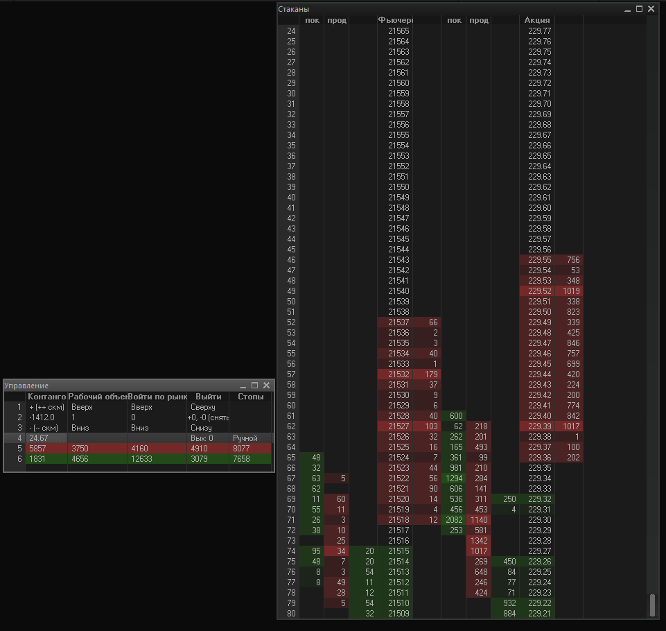

# Скальперский привод для Quik

Небольшой скальперский привод на чистом LUA, без использования сторонних языков. Задумывался скорее
как заготовка для дальнейшей автоматизации действий. Состоит из двух таблиц, поскольку Quik не
предоставляет других элементов интерфейса. Основное окно(справа) содержит два стакана, по фьючерсу
и по акции, цены в них смещены на контанго, вычисленное при старте скрипта. Слева от каждого стакана
показываются сделки, разделенные на покупки и продажи, так удобнее отслеживать, кто проявляет большую
активность, продавцы или покупатели. По умолчанию интервал стирания сделок 60 сек, или при
центрировании или прокрутке стакана клавишами. Сделки также записываются в правые нижние ячейки
таблицы "Управление", и при стирании продвигаются влево.

В стакане на фьючерс также как и в стандартном "быстром" стакане можно поставить лимитки кликом
на столбце покупки или продажи, размер будет соответствовать текущему рабочему объему, по умолчанию
1 контракт. Если цена лучше рыночной, то она исполнится биржей по рынку, если хуже, то лимитка
будет висеть на своем месте. Заявка подсвечивается бирюзовым цветом в центре стакана, для снятия
нужно щелкнуть на неё колесиком мыши. В данный момент подсвечивается только последняя введенная
лимитка, поэтому лучше держать рядом таблицу с заявками, для контроля. Нажав мышь в среднем ряду
можно поставить стоп-заявку, она поставится в размере текущей открытой позиции. Там где нажата
мышь соответственно будет цена срабатывания, цена заявки в 50 пунктах от неё (это хардкод в
функции `setFuturesStop()` в [interfaceFunctions.lua](utf-8/interfaceFunctions.lua)). Стоп будет
подсвечен фиолетовым.
При клике колесом на подсветку он будет снят, но выводится только один стоп, поэтому лучше держать
рядом таблицу с стоп-заявками. Также можно выделить ячейку покупки или продажи, если кликнуть на
неё скм. Так можно виртуально торговать или подсветить какие-то объёмы.

В стакане на акцию можно поставить подобие входа стоп-лимитом по другой бумаге. Подобие потому,
что при создании нормальной заявки биржа отдавала ошибки случайным образом. При клике на среднем
столбце акции будет подсвечен вход стопом в соответствии с направлением, где он поставлен. Если
стакан дойдет до этой цены, то сработает вход по рынку на фьючерсе. Это не очень хорошо работает,
позже будут сделаны различные варианты учитывающие сделки.

Также при фокусе на основном окне работают горячие клавиши:

| Клавиша               | Функция                                                            |
|-----------------------|--------------------------------------------------------------------|
| <kbd>w</kbd>          | покупка по рынку                                                   |
| <kbd>s</kbd>          | продажа по рынку                                                   |
| <kbd>a</kbd>          | лимитка на покупку в спреде                                        |
| <kbd>d</kbd>          | лимитка на продажу в спреде                                        |
| <kbd>q</kbd>          | автоматически лимитка и стоп для выхода,в 20 пунктах от цены входа |
| <kbd>0 (NumPad)</kbd> | отцентрировать стакан                                              |
| <kbd>Esc</kbd>        | Снять все заявки                                                   |
| <kbd>Del</kbd>        | Снять все заявки, и выйти по рынку                                 |
| <kbd>↑</kbd>          | Прокрутка стакана на 15 пунктов вверх                              |
| <kbd>↓</kbd>          | Прокрутка стакана на 15 пунктов вниз                               |
| <kbd>1</kbd>          | рабочий объем = 1 контракт                                         |
| <kbd>2</kbd>          | рабочий объем = 2 контракта                                        |
| <kbd>3</kbd>          | рабочий объем = 5 контрактов                                       |
| <kbd>4</kbd>          | рабочий объем = 10 контрактов                                      |
| <kbd>5</kbd>          | рабочий объем = 15 контрактов                                      |

Более точно доступные действия можно посмотреть в методе `metrics:handleEvent()` класса
[metricsTable.lua](utf-8/metricsTable.lua)

## Структура проекта
Для удобства чтения на гитхабе сделал  utf-8 версию всех файлов в папке соответственно
[utf-8](utf-8).

| Файл                                                   | Описание                                                                                                |
|--------------------------------------------------------|---------------------------------------------------------------------------------------------------------|
| твоя копия [SRZ0_example.lua](SRZ0_example.lua)        | Точка входа и файл настроек. Он запускается в квике, и он импортирует остальные файлы                   |
| [privod.lua](utf-8/privod.lua)                         | Основной цикл программы и реакция на всякие сделки/котировки                                            |
| [metricsTable.lua](utf-8/metricsTable.lua)             | Класс большой таблицы. Тут горячие клавиши, реакции на нажатия и отрисовка всего в ней                  |
| [controlTable.lua](utf-8/controlTable.lua)             | Класс маленькой таблицы. То же самое для малой таблицы, добавлю что позиция и размер окна указаны здесь |
| [interfaceFunctions.lua](utf-8/interfaceFunctions.lua) | Функции которые могут быть одновременно вызваны из нескольких мест. Например найти цену входа           |
| [tradingFunctions.lua](utf-8/tradingFunctions.lua)     | Функции купить/продать бумагу                                                                           |

## Инструкция по установке
1. Скачиваем привод куда удобнее
2. Делаем свою копию файла настроек **SRZ0_example.lua**, я обычно называю `<бумага>_<терминал>.lua`,
	например **sber_sber.lua** или **sber_bks.lua**

Далее для настроек нужен файл с парой сделок из кармана транзакций, поэтому:

3. Добавляем окно кармана транзакций: `Создать окно` -> `Все типы окон...` -> `Карман транзакций...` ,
	через страдания создаем окно кармана, на ввод заявки (если это на что-то влияет)
4. Кладем в карман заявку на покупку акции: `Правая кнопка мыши на кармане` -> `положить в карман`,
	кладем в него заявку на покупку акции, указав все коды клиента
5. Аналогично кладем заявку на покупку фьючерса
6. Сохраняем всё в файл: `Правая кнопка мыши на кармане` -> `Сохранить транзакции в tri-файл`
7. Открываем этот файл редактором вроде **Notepad++** или **Sublime Text**, ставим виндовую кодировку
	если кракозябры, для удобства можно заменить **";"** на **";\n"**, чтобы добавились переносы строки
8. по подсказкам в комментариях заполняем наш скопированный файл настроек

Всё, теперь имея нормальный файл конфигурации нужно настроить QUIK:

9. Создаем на отдельной вкладке стаканы для фьючерса и акции, например двойным кликом на инструменте
	в таблице основных торгов .Это нужно, чтобы терминал скачивал эти котировки
10. Создаем на той же вкладке таблицы обезличенных сделок для фьючерса и акции: `Создать окно` ->
	`Таблица обезличенных сделок`. Это нужно, чтобы терминал скачивал эти сделки
11. Лучше где-то разместить таблицу заявок и стоп-заявок, на случай если привод затупит - так хоть
	руками снимешь
12. Подцепляем скрипт в терминале: `Сервисы` -> `Lua скрипты...`, Там жмем `"Добавить"` и добавляем
	наш файл настроек
13. Запускаем, пробуем, используем

При необходимости в методах `init()` в классах таблиц можно поправить под себя их начальные размеры
и положение.
